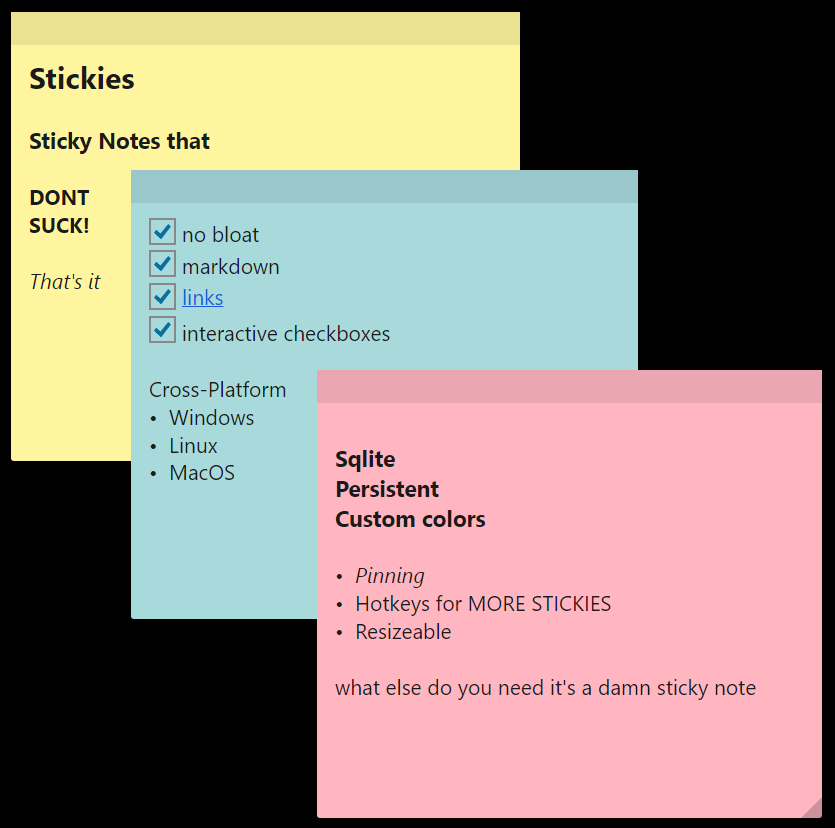

# Stickies

<p align="center">
  
</p>

**Sticky Notes that DON'T SUCK. That's it.**

- no bloat
- markdown
- links
- interactive checkboxes
- SQLite-persistent
- custom colors
- pinning
- hotkeys for MORE STICKIES
- resizeable
- cross-platform: Windows · macOS · Linux

What else do you need. It's a damn sticky note.

## Get it

Latest binaries: [Releases](https://github.com/obselate/Stickies/releases).

**Windows** — `.msi` (per-user, no UAC) or `.zip` with `Stickies.exe`. SmartScreen → More info → Run anyway (unsigned).

**macOS (Apple Silicon)** — mount the `.dmg`, drag to `/Applications`, then:

```bash
xattr -cr /Applications/Stickies.app
```

(clears Gatekeeper quarantine on the unsigned build).

**Linux (x64)** — `chmod +x` the `.AppImage` and run it. Needs FUSE: `libfuse2` on 22.04/Debian, `libfuse2t64` on Ubuntu 24.04+, `fuse-libs` on Fedora. Or run with `--appimage-extract-and-run`.

## Hotkeys

| | Win / Linux | macOS |
|---|---|---|
| New note (global) | Ctrl+Shift+N | ⌘⇧N |
| New from a note | Ctrl+N | ⌘N |
| Delete note | Ctrl+D | ⌘D |
| Change color | right-click → swatch · `…` for HSV picker | |
| Pin on top | right-click → Pin on top | |

Linux global hotkey is X11 only; on pure Wayland it silently no-ops.

## Build

.NET 9 SDK, then:

```bash
dotnet publish -c Release -r <win-x64|osx-arm64|linux-x64>
```

Per-platform packagers: `installer/Stickies.wixproj` (MSI), `build/mac/package.sh` (.dmg), `build/linux/package.sh` (.AppImage). NativeAOT doesn't cross-compile — build on the matching host.

Stack: Avalonia 11.3 · .NET 9 NativeAOT · Microsoft.Data.Sqlite. No MVVM framework, no telemetry, no AI.
